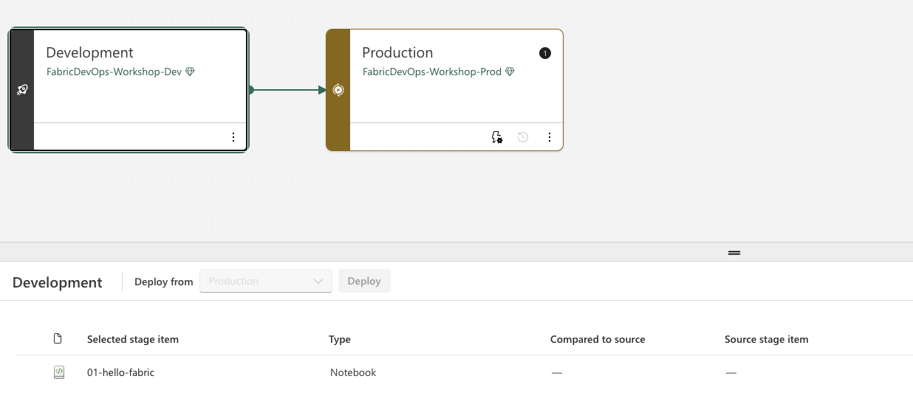

# Lesson 2.1: Setting Up a Deployment Pipeline

## Why Separate Environments?

Before we set up a deployment pipeline, let's talk about **why** you'd want separate development and production environments in the first place.

### 🚧 "I broke production"

You're making changes to a report, and suddenly users are calling because something's broken. You were just trying to add a new chart, but now nothing works—and everyone sees it.

**Separate environments solve this:** Make all your changes in development. Users only see production, which stays stable until you're ready to deploy.

### 🔒 "Who has access to what?"

Production data is sensitive. You don't want every developer to have full access to customer data, financials, or other confidential information just because they need to build a report.

**Separate environments solve this:** Dev can use sample data or limited datasets. Only production connects to the real data, and access is tightly controlled.

### 📋 "What changed and when did it go live?"

An executive asks why a number looks different than last week. You need to know exactly what changed in production and when.

**Separate environments solve this:** Deployment pipelines create a clear record of what was deployed, when, and by whom.

### 👥 "Users see half-finished work"

You're in the middle of building something new. It's not ready yet, but because you're working directly in production, users see your work-in-progress—confusing labels, broken visuals, incomplete data.

**Separate environments solve this:** Keep work-in-progress in development. Deploy to production only when it's complete and tested.

---

### The Bottom Line

| Without Separate Environments | With Dev/Prod Separation |
|-------------------------------|--------------------------|
| Changes immediately affect users | Users see only tested, approved changes |
| Everyone needs access to production data | Limit sensitive data access to production only |
| No record of what went live when | Clear deployment history |
| Users see incomplete work | Deploy only when ready |

**Separate environments aren't just for large teams.** Even solo developers benefit from having a place to work without affecting what users see.

Now let's set up your environments and connect them with a deployment pipeline!

---

## Overview

In this lesson, you'll create a deployment pipeline to move your Fabric items from development to production. Deployment pipelines provide a structured way to promote your work through different environments, ensuring that changes are tested before reaching production.

By the end of this lesson, you will have:

- A production workspace
- A deployment pipeline connecting your dev and prod workspaces

**Estimated Time:** 15-20 minutes

**Prerequisites:**
- Completed Section 1 (Git Basics)
- Your development workspace with at least one notebook

---

## What Are Deployment Pipelines?

Deployment pipelines let you manage the lifecycle of your Fabric content across different environments. A typical setup includes:

- **Development** - Where you build and experiment
- **Test** - Where you validate changes (optional)
- **Production** - Where end users access the content

> 💡 **Note:** Deployment pipelines support up to three stages (Development, Test, Production), but we'll keep it simple in this lesson and use just **Dev** and **Prod**. You can always add a Test stage later.

### Why Use Deployment Pipelines?

| Benefit | Description |
|---------|-------------|
| **Controlled releases** | Changes go through a defined process before reaching production |
| **Reduced risk** | Test in lower environments before impacting users |
| **Easy comparison** | See differences between stages at a glance |
| **Quick rollback** | If something goes wrong, you know exactly what changed |

---

## Set Up Your Workspaces

First, let's prepare your dev workspace and create a new production workspace.

### Rename Your Workspace to Dev

Your original workspace is about to become your official development environment. Let's rename it to make that clear.

1. Go to your workspace (`FabricDevOps-Workshop`)
2. Click the **Workspace settings** gear icon
3. Change the name to `FabricDevOps-Workshop-Dev`
4. Close the settings panel (changes save automatically)

### Create the Production Workspace

1. In the left navigation pane, click on **Workspaces**
2. Click the **+ New workspace** button
3. Name it `FabricDevOps-Workshop-Prod`
4. Expand the **Advanced** section
5. Ensure you have a Fabric capacity selected under **License mode**
6. Click **Apply**

> 💡 **Naming Convention:** Using a consistent naming pattern (like `-Dev`, `-Test`, `-Prod` suffixes) makes it easy to identify which environment a workspace belongs to.

You should now have two workspaces:

| Workspace | Purpose |
|-----------|---------|
| `FabricDevOps-Workshop-Dev` | Development - where you build and test |
| `FabricDevOps-Workshop-Prod` | Production - where users access content |

The production workspace will be empty for now—that's expected! We'll deploy content to it using the pipeline.

---

## Create a Deployment Pipeline

Now let's create a pipeline to connect these workspaces.

1. In the left navigation pane, click on **Workspaces**
2. At the bottom of the workspaces panel, click on **Deployment pipelines**
   - Or go directly to: [https://app.fabric.microsoft.com/pipelines](https://app.fabric.microsoft.com/pipelines)
3. Click **+ New pipeline**
4. Enter a name for your pipeline (e.g., `FabricDevOps-Workshop-Pipeline`)
5. Click **Next**

---

## Configure Pipeline Stages

Before creating the pipeline, you need to define its structure. By default, Fabric provides three stages: Development, Test, and Production.

Since we're keeping things simple with just Dev and Prod:

1. You'll see three stages: **Development**, **Test**, and **Production**
2. Click the **trash can** icon on the **Test** stage to remove it
3. You should now have just two stages: **Development** and **Production**
4. Click **Create and continue**

> 💡 **Note:** The number of stages is permanent—you can't change it after the pipeline is created. You can have anywhere from 2 to 10 stages.

---

## Assign Workspaces to Stages

Now we need to connect your workspaces to the pipeline stages.

### Assign the Development Stage

1. In the **Development** stage, expand the **Assign a workspace** dropdown
2. Select your development workspace (`FabricDevOps-Workshop-Dev`)
3. Click the **checkmark** button to assign

You should see your notebook and any other items appear in the Development stage.

### Assign the Production Stage

1. In the **Production** stage, expand the **Assign a workspace** dropdown
2. Select your production workspace (`FabricDevOps-Workshop-Prod`)
3. Click the **checkmark** button to assign

The Production stage will show as empty since we haven't deployed anything yet.

---

## Review Your Pipeline

Take a moment to look at what you've set up.

### What You Should See

- **Development stage:** Shows your notebook and any other items from your dev workspace. You can see that your `01-hello-fabric` notebook exists in this workspace.

- **Production stage:** Empty (no content deployed yet). Notice the notebook appears with a green **+** icon—this indicates it exists only in the source (Dev) and will be added when you deploy.

The pipeline interface also shows:
- Comparison indicators between stages
- The number of items in each stage
- Whether stages are in sync or have differences

> 💡 **Note:** We're not deploying to production just yet—that's coming up in a later lesson. First, we'll learn about tagging releases.

---

## Summary

In this lesson, you:

- ✅ Created a production workspace
- ✅ Created a deployment pipeline
- ✅ Connected your dev and prod workspaces to the pipeline

Your pipeline is now ready to deploy content from Development to Production!

### Key Concepts

1. **Deployment Pipelines** - A managed way to promote content between environments
2. **Stages** - Represent different environments (Dev, Test, Prod)
3. **Workspace Assignment** - Each stage is connected to a specific workspace

---

## Troubleshooting

### Common Issues

**Issue: Can't see Deployment pipelines option**
- Deployment pipelines require a Fabric capacity or Premium capacity
- Check that your workspaces are assigned to a supported capacity

**Issue: Can't assign a workspace to a stage**
- You must be a workspace admin to assign it to a pipeline
- The workspace must be on a supported capacity
- A workspace can only be assigned to one pipeline at a time

**Issue: Can't delete the Test stage**
- Make sure you click the **trash can** icon on the stage before clicking Create
- The number of stages is permanent after the pipeline is created

---

**Previous:** [Lesson 1.3: Undoing Uncommitted Changes](../section-01-git-basics/lesson-1.3-undoing-uncommitted-changes.md)  
**Next:** [Lesson 2.2: Tagging Releases](lesson-2.2-tagging-releases.md)
